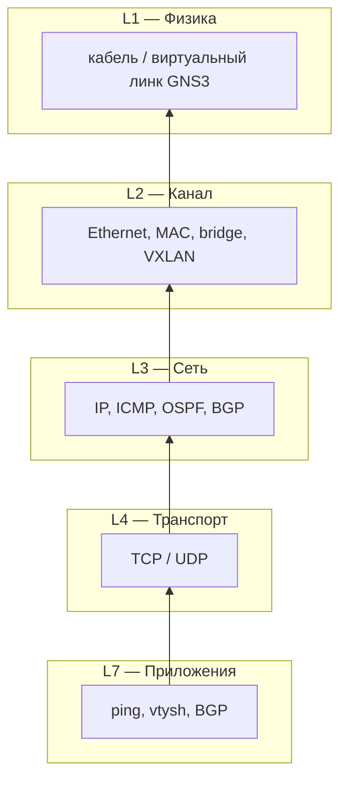
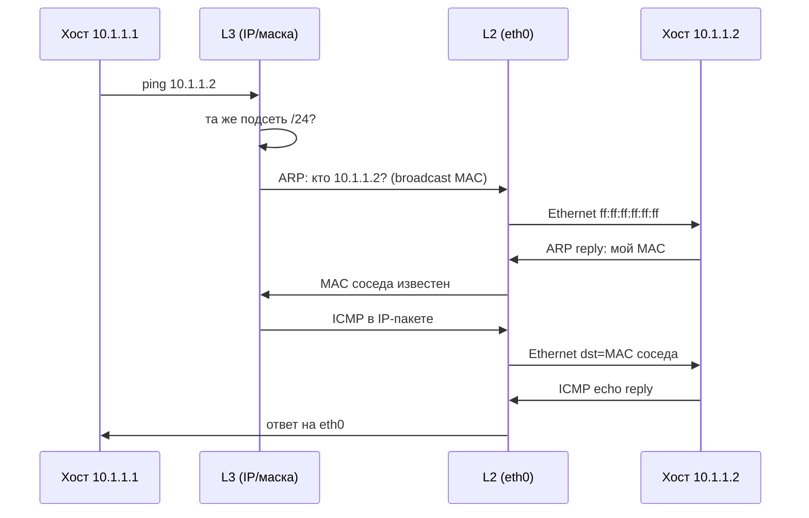
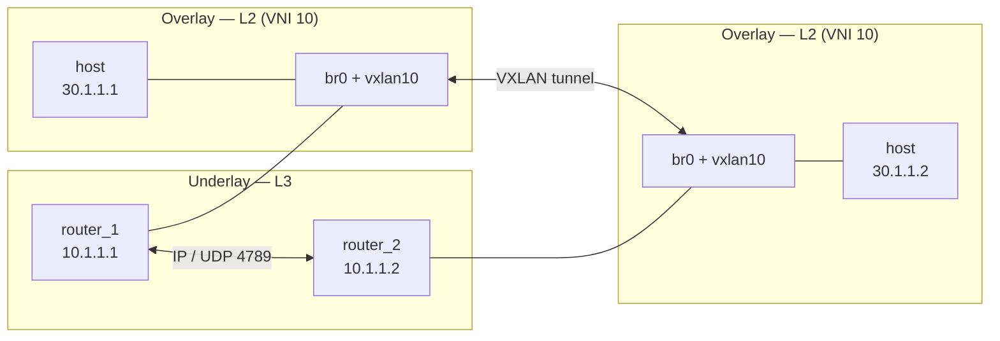

# Маски подсетей, IP-адресация и сетевые интерфейсы

## Простыми словами

Когда хост «пингует» `10.1.1.2`, он должен понять две вещи:

1. **Этот адрес в моей подсети или за пределами?** — решает маска.
2. **На какой физический порт отправить кадр?** — решает интерфейс (например, `eth0`).

**Маска подсети** — правило, которое делит 32-битный IPv4-адрес на две части: «адрес сети» и «номер хоста внутри сети». Без маски невозможно понять, кто «сосед» (доступен напрямую по L2), а кто «далеко» (нужен маршрутизатор).

В проекте маски встречаются везде: `/24` на хостах Part 1–2, `/30` на point-to-point линках underlay в Part 3, `/32` на loopback VTEP.

---

## Что такое L2 и L3

**L2** и **L3** — сокращения от **Layer 2** и **Layer 3** модели OSI (стек протоколов «снизу вверх»). В разговорной сетевой речи «это L2» = «работает на канальном уровне», «это L3» = «работает на сетевом уровне».

Упрощённая картинка:

```text
L7  Приложения          ping, браузер, BGP-клиент
L4  Транспорт           TCP, UDP
L3  Сеть                IP, ICMP, OSPF, BGP (как маршрутизация)
L2  Канал               Ethernet, MAC, bridge, свитч
L1  Физика              кабель, оптика, радио
```

Схема стека (снизу вверх — как данные «упаковываются» при отправке):



Каждый уровень добавляет свой заголовок поверх нижележащего. Роутер на L3 «снимает» IP и кладёт пакет в **новый** L2-кадр — поэтому MAC меняется на каждом hop, а IP (обычно) остаётся тем же.

В проекте чаще всего говорят только про **L2** и **L3** — именно они решают, *как* пакет дойдёт от хоста до хоста.

### L2 — канальный уровень (Data Link)

**Задача:** доставить **кадр** (frame) от одного интерфейса к другому **в пределах одного L2-сегмента** — одной «проводной» (или виртуальной) сети Ethernet.

| | |
|--|--|
| **Единица данных** | Ethernet-кадр |
| **Адрес** | MAC (`aa:bb:cc:dd:ee:ff`) |
| **Кто работает на L2** | свитч, Linux bridge (`br0`), VXLAN как L2-порт |
| **Как ищут получателя** | по MAC в заголовке кадра, таблица FDB/CAM |
| **Граница сегмента** | broadcast domain — все, кто слышит `ff:ff:ff:ff:ff:ff` |

L2 **не знает** про подсети и маски. Свитчу всё равно, `10.1.1.1` это или `30.1.1.1` — он смотрит только на destination MAC в Ethernet-заголовке.

Типичные L2-вещи в проекте:

- хост шлёт кадр с MAC соседа;
- `brctl` / bridge объединяет `eth1` и `vxlan10` в один L2-домен (Part 2–3);
- ARP-запрос уходит broadcast'ом на L2;
- EVPN Type 2 публикует MAC, чтобы VTEP знал, куда слать кадр в overlay.

Подробнее про MAC: [`docs/MAC.md`](MAC.md).

### L3 — сетевой уровень (Network)

**Задача:** доставить **пакет** (packet) **между разными IP-подсетями** — через цепочку маршрутизаторов, если получатель не «рядом» по L2.

| | |
|--|--|
| **Единица данных** | IP-пакет |
| **Адрес** | IPv4 / IPv6 (`10.1.1.1`, `1.1.1.2`) |
| **Кто работает на L3** | роутер, Linux с `ip route`, FRR (zebra, OSPF, BGP) |
| **Как ищут получателя** | таблица маршрутизации + маска подсети |
| **Граница** | подсеть (prefix) — «кто on-link, кто за gateway» |

L3 **не заменяет** L2: на каждом hop пакет всё равно упаковывается в кадр с MAC следующего узла. Роутер принимает кадр на свой MAC, снимает IP, смотрит маршрут, кладёт IP в **новый** кадр с MAC следующего хопа.

Типичные L3-вещи в проекте:

- `ip addr add 10.1.1.1/24` — IP и маска на интерфейсе;
- ping (`ICMP` поверх IP);
- OSPF на underlay (`10.1.1.x/30`) — кто как добраться до `1.1.1.x/32`;
- BGP EVPN — контроль overlay, но underlay всё равно IP-маршрутизация;
- VXLAN outer header — UDP/IP между VTEP (это уже L3-транспорт для L2 внутри).

### L2 vs L3 — одна таблица

| | **L2** | **L3** |
|--|--------|--------|
| Вопрос | «На каком **порту** этот MAC?» | «Какой **путь** до этой IP-сети?» |
| Адрес | MAC | IP |
| Устройство | свитч, bridge | роутер |
| Масштаб | один сегмент (VLAN, VNI, один wire) | вся сеть, много подсетей |
| Broadcast | да, внутри сегмента | нет глобального IP-broadcast через интернет |
| В проекте | VXLAN VNI 10, `br0`, MAC хостов | `/24`, `/30`, OSPF, loopback `1.1.1.x` |

### Как L2 и L3 работают вместе (ping соседа)

Хост `10.1.1.1/24` пингует `10.1.1.2` (Part 1):

```text
1. L3: 10.1.1.2 в моей подсети → шлюз не нужен
2. L3→L2: ARP «кто 10.1.1.2?» (broadcast MAC ff:ff:…)
3. L2: сосед отвечает «я 10.1.1.2, мой MAC xx:xx:…»
4. L3: ICMP echo в IP-пакете
5. L2: IP упакован в Ethernet: dst MAC соседа, src MAC свой
6. Кадр уходит в eth0
```



Если бы пинговали адрес **из другой подсети**, на шаге 1 L3 отправил бы пакет **MAC шлюза**, а не конечного хоста.

### Underlay и overlay в терминах L2/L3

В Part 2–3 часто говорят **underlay** и **overlay**:

```text
UNDERLAY (L3)                    OVERLAY (L2 поверх L3)
─────────────────                ─────────────────────────
10.1.1.1 ←──IP──→ 10.1.1.2      30.1.1.1 ←─MAC/L2──→ 30.1.1.2
     роутеры, VXLAN UDP               хосты «как в одном свитче»
     OSPF, loopback 1.1.1.x           VNI 10, bridge, EVPN
```



- **Underlay** — обычная IP-сеть между роутерами (L3). Без неё VTEP не достучатся друг до друга.
- **Overlay** — виртуальный L2-сегмент (VXLAN). Хосты думают, что сидят в одном Ethernet; между ними летят те же MAC-кадры, но в UDP-туннеле по underlay.

Маска `/24` на `30.1.1.1` — это **L3** внутри overlay. VNI 10 — это **L2**-граница «кто в одном виртуальном свитче».

### Что запомнить

- **L2** = MAC, кадры, один broadcast domain, bridge/VXLAN.
- **L3** = IP, пакеты, подсети, маршруты, роутеры.
- Маски подсетей — чисто **L3**. Ethernet-интерфейс — в первую очередь **L2**-порт; IP на нём — L3-настройка поверх.
- Проблема «не пингуется» может быть и на L2 (нет MAC в FDB, bridge down), и на L3 (нет маршрута, не та маска).

---

## IPv4-адрес: 32 бита

IPv4 — четыре октета (байта), каждый от 0 до 255:

```text
10 . 1 . 1 . 1
│    │    │    └── хост (в зависимости от маски)
│    │    └─────── ...
└──────────────── вся запись = 32 бита
```

Тот же адрес в двоичном виде:

```text
10.1.1.1  =  00001010 . 00000001 . 00000001 . 00000001
```

Для расчётов подсетей удобно мыслить именно битами: маска «отрезает» справа столько бит, сколько отдано под хосты.

---

## Две записи одной и той же маски

### Классическая запись (dotted decimal)

```text
255.255.255.0
```

Четыре октета. Единицы слева = «это сеть», нули справа = «это хост».

### CIDR-запись (префикс)

```text
/24
```

Число после `/` — сколько **первых** бит принадлежат сети. Остальные `32 − N` бит — хостовая часть.

| CIDR | Маска (decimal) | Хостовых бит | Адресов в блоке |
|------|-----------------|--------------|-----------------|
| /32  | 255.255.255.255 | 0            | 1 (только один адрес) |
| /30  | 255.255.255.252 | 2            | 4 |
| /24  | 255.255.255.0   | 8            | 256 |
| /16  | 255.255.0.0     | 16           | 65 536 |
| /8   | 255.0.0.0       | 24           | 16 777 216 |

В Linux обычно пишут сразу с адресом:

```bash
ip addr add 10.1.1.1/24 dev eth0
```

`/24` здесь и есть маска.

---

## Как маска делит адрес

Возьмём `10.1.1.50/24`:

```text
IP:     10 .   1 .   1 .  50
        ────────────────  ───
        сеть (24 бита)    хост (8 бит)

Маска:  255.255.255.0  =  /24
        11111111.11111111.11111111.00000000
```

Операция **побитовое И (AND)** между IP и маской даёт **адрес сети** (network address):

```text
  10.1.1.50    = 00001010.00000001.00000001.00110010
& 255.255.255.0 = 11111111.11111111.11111111.00000000
─────────────────────────────────────────────────────
  10.1.1.0     = 00001010.00000001.00000001.00000000  ← сеть
```

Все хосты с маской `/24`, у которых первые три октета `10.1.1`, считаются **в одной подсети** `10.1.1.0/24`.

---

## Три ключевых адреса в каждой подсети

Для подсети с маской короче `/31` (т.е. когда есть отдельная хостовая часть):

| Адрес | Значение | Пример для 10.1.1.0/24 |
|-------|----------|------------------------|
| **Network** | первый адрес, «имя сети», хосту не назначается | `10.1.1.0` |
| **Broadcast** | последний адрес, «всем в этой подсети» | `10.1.1.255` |
| **Usable hosts** | всё между network и broadcast | `10.1.1.1` … `10.1.1.254` |

**Broadcast** получается, если в хостовой части все биты = 1:

```text
10.1.1.255 = 10.1.1.0 с хостовыми битами 11111111
```

Пакет на broadcast-адрес получают **все** хосты подсети (на L2 это обычно `ff:ff:ff:ff:ff:ff`).

### Сколько usable-хостов?

```text
Количество адресов  = 2^(хостовые биты)
Usable (классика)   = 2^(хостовые биты) − 2   # минус network и broadcast
```

Для `/24`: `2^8 = 256` адресов, `254` usable.

Исключения:

- **`/32`** — один адрес, network = broadcast = сам адрес (типично loopback).
- **`/31`** (RFC 3021) — point-to-point: оба адреса usable, broadcast не используется.
- **`/30`** — 4 адреса: 2 usable (часто оба конца линка), network и broadcast «съедают» по одному.

---

## Пошаговый расчёт диапазона (пример /24)

**Задача:** определить диапазон для `30.1.1.0/24` (Part 2, overlay-сеть хостов).

1. **Префикс** = 24 бита → сеть `30.1.1.0`, маска `255.255.255.0`.
2. **Хостовые биты** = `32 − 24 = 8`.
3. **Шаг (размер блока в последнем октете)** = `2^8 = 256` → границы только на `.0` и `.255` в 4-м октете.
4. **Network** = `30.1.1.0`.
5. **Broadcast** = `30.1.1.255`.
6. **Usable** = `30.1.1.1` … `30.1.1.254`.

В проекте:

```bash
# P2/_dmiasnik-1_host
ip addr add 30.1.1.1/24 dev eth0

# P2/_dmiasnik-2_host
ip addr add 30.1.1.2/24 dev eth0
```

Оба в одной L2/L3-подсети → могут общаться напрямую (через bridge + VXLAN, но с точки зрения IP — соседи).

---

## Пример /30 — линк «роутер — роутер»

В Part 3 underlay между VTEP и Route Reflector:

```text
RR eth0  ←→  VTEP_2 eth0
10.1.1.1/30     10.1.1.2/30
```

Расчёт для `10.1.1.0/30`:

```text
Маска /30 = 255.255.255.252
            11111111.11111111.11111111.11111100
                                      ^^
                              только 2 хостовых бита
```

Блоки `/30` идут шагом **4** в последнем октете: `.0`, `.4`, `.8`, `.12` …

Для блока начиная с `10.1.1.0`:

| Адрес | Роль |
|-------|------|
| `10.1.1.0` | network |
| `10.1.1.1` | usable (RR) |
| `10.1.1.2` | usable (VTEP_2) |
| `10.1.1.3` | broadcast |

Следующий блок `/30`: `10.1.1.4/30` — RR eth1 к VTEP_3 (`10.1.1.5` и `10.1.1.6`), затем `10.1.1.8/30` к VTEP_4 (`10.1.1.9` и `10.1.1.10`).

**Зачем /30 на линках?** Между двумя роутерами нужны ровно 2 адреса. `/30` (или /31) не тратит целую /24 на каждый кабель.

---

## Пример /32 — loopback

```bash
ip addr add 1.1.1.2/32 dev lo
```

`/32` = «эта сеть состоит из одного адреса». Для loopback VTEP это идеально: BGP/OSPF анонсируют `1.1.1.2` как отдельный префикс, VXLAN использует его как **VTEP IP** (outer destination в UDP).

Network = broadcast = `1.1.1.2`. Usable — тот же адрес.

---

## Как понять «в моей подсети или нет»

У хоста `10.1.1.1/24` соседи — все с тем же префиксом `10.1.1.0/24`.

Алгоритм:

1. Вычислить **свою** сеть: `10.1.1.1 AND 255.255.255.0` → `10.1.1.0/24`.
2. Вычислить **сеть назначения** для `10.1.1.2` → тоже `10.1.1.0/24`.
3. Сети совпали → **on-link**, пакет идёт напрямую (сначала ARP за MAC).
4. Для `192.168.1.5` сеть другая → пакет отдаётся **шлюзу по умолчанию** (default gateway).

Проверка в Linux:

```bash
ip route get 10.1.1.2    # покажет: dev eth0, src 10.1.1.1
ip route get 8.8.8.8     # покажет: via <gateway>, если маршрут есть
```

---

## Маска и маршрутизация

**Маршрут** — запись «чтобы достичь сети X, отправь пакет сюда».

```text
10.1.1.0/24 dev eth0        # прямая подсеть на интерфейсе
1.1.1.2/32 via 10.1.1.1     # конкретный хост через соседа
0.0.0.0/0 via 10.1.1.254    # default route — «всё остальное»
```

Префикс в маршруте — та же CIDR-запись. Чем **длиннее** префикс (больше число после `/`), тем **уже** сеть и тем **выше** приоритет при совпадении (longest prefix match).

В Part 1 хосты в одной `/24` — маршруты по умолчанию не нужны, ping работает напрямую.

В Part 3 OSPF раздаёт маршруты до loopback `1.1.1.x/32` по underlay, а overlay `20.1.1.0/24` живёт за VXLAN/EVPN.

---

## Что такое сетевой интерфейс

**Сетевой интерфейс** — точка подключения стека TCP/IP к какому-то каналу передачи. У каждого интерфейса есть:

- **имя** (`eth0`, `lo`, `vxlan10`, `br0`);
- **состояние** UP/DOWN;
- **MAC-адрес** (кроме чисто L3-интерфейсов вроде `lo`);
- **один или несколько IP** (можно несколько на одном интерфейсе).

Посмотреть:

```bash
ip link show              # все интерфейсы, MAC, UP/DOWN
ip addr show eth0         # IP-адреса на eth0
ip -d link show vxlan10   # детали VXLAN
```

### Ethernet-интерфейс (`eth0`, `eth1`, …)

**Ethernet** — самая распространённая L2-технология (кадры с MAC-адресами). В Linux имена `ethN` традиционно означают Ethernet-подобный интерфейс.

В Docker/GNS3 контейнер получает виртуальные `eth0`, `eth1`:

```text
host          router
eth0 ──────── eth0     # underlay, IP 10.x.x.x
              eth1 ─── br0 ─── vxlan10   # L2 к хосту overlay
```

**Ethernet-интерфейс** на практике = «порт», через который уходят **Ethernet-фреймы**. IP-адрес вешается **поверх** этого порта: он нужен для L3 (ping, BGP, OSPF), но физическая (виртуальная) доставка внутри сегмента всё равно идёт по MAC.

Связь уровней:

```text
┌─────────────────────────────────────┐
│  Приложение (ping, BGP, …)          │
├─────────────────────────────────────┤
│  IP (10.1.1.1/24)                   │  ← L3, маска подсети
├─────────────────────────────────────┤
│  Ethernet (MAC aa:bb:cc:… )         │  ← L2, интерфейс eth0
├─────────────────────────────────────┤
│  «Провод» / виртуальный линк GNS3   │  ← L1
└─────────────────────────────────────┘
```

Подробнее про MAC: [`docs/MAC.md`](MAC.md).

### Loopback (`lo`)

Виртуальный интерфейс «на самого себя». Всегда UP. В Part 3 на `lo` висит `1.1.1.x/32` — стабильный router ID и VTEP IP, не зависящий от состояния физического порта.

### Bridge (`br0`)

Не Ethernet сам по себе, а **программный свитч**: объединяет несколько портов в один L2-домен. IP можно повесить на `br0`, а можно только на `eth` — в Part 2 IP underlay на `eth0`, overlay L2 через `br0`.

### VXLAN (`vxlan10`)

Тоже интерфейс в `ip link`, но инкапсулирует Ethernet в UDP. С точки зрения bridge — ещё один L2-порт.

---

## Команда `ip addr add` — что происходит

```bash
ip addr add 10.1.1.1/24 dev eth0
ip link set eth0 up
```

1. На интерфейс `eth0` добавляется IPv4 `10.1.1.1` с префиксом `/24`.
2. Ядро автоматически создаёт **connected route**: `10.1.1.0/24 dev eth0 scope link`.
3. `ip link set eth0 up` — интерфейс активен, можно слать и принимать кадры.

Без `up` линк DOWN — сосед не увидит ни ARP, ни ping.

Удалить адрес:

```bash
ip addr del 10.1.1.1/24 dev eth0
```

---

## Таблица масок из проекте

| Часть | Подсеть | Маска | Кто | Зачем |
|-------|---------|-------|-----|-------|
| P1 | `10.1.1.0/24` | /24 | host + router | простая связность, один L2-сегмент |
| P2 underlay | `10.1.1.0/24` | /24 | роутеры | IP для VXLAN endpoint (`remote`) |
| P2 overlay | `30.1.1.0/24` | /24 | хосты | одна L2-сеть через туннель |
| P3 underlay | `10.1.1.0/30`, `.4/30`, `.8/30` | /30 | RR ↔ VTEP | point-to-point линки OSPF |
| P3 loopback | `1.1.1.x/32` | /32 | все роутеры | BGP router-id, VTEP source IP |
| P3 overlay | `20.1.1.0/24` | /24 | хосты за VTEP | ping в EVPN-сегменте |

---

## Практика: ручной расчёт (упражнение)

**Дано:** `172.16.50.100/26`. Найти network, broadcast, диапазон хостов.

1. `/26` → маска `255.255.255.192` → хостовые биты = 6.
2. Последний октет `100` = `01100100` в двоичном.
3. Маска в последнем октете `192` = `11000000` → сеть «замораживает» первые 2 бита октета: `01xxxxxx`.
4. `100 AND 192` = `64` → network = `172.16.50.64/26`.
5. Broadcast: хостовые 6 бит = все 1 → `64 + 63` = `127` → `172.16.50.127`.
6. Usable: `172.16.50.65` … `172.16.50.126` (всего `2^6 − 2 = 62` хоста).

**Шаг для /26, /27, /28** в последнем октете — степень двойки:

| Маска в 4-м октете | CIDR (в /24-сети) | Размер блока |
|--------------------|-------------------|--------------|
| 192 | /26 | 64 |
| 224 | /27 | 32 |
| 240 | /28 | 16 |
| 248 | /29 | 8 |
| 252 | /30 | 4 |

---

Проверка соседа:

```bash
ping -c 2 10.1.1.2
ip neigh show              # ARP-таблица: IP → MAC
tcpdump -i eth0 arp        # видеть ARP-запросы
```

---

## Маска vs VLAN vs VNI

Легко перепутать — это разные оси:

| Понятие | Уровень | Что делит |
|---------|---------|-----------|
| **Маска / CIDR** | L3 (IP) | «кто в одной IP-подсети» |
| **VLAN (802.1Q)** | L2 | логические сегменты на одном свитче |
| **VNI (VXLAN)** | Overlay L2 | виртуальные сегменты поверх IP underlay |

В Part 2–3 VNI 10 объединяет хостов в один L2, а IP `30.1.1.x` или `20.1.1.x` с `/24` задаёт L3-подсеть внутри этого сегмента.

---

## Полезные команды (шпаргалка)

```bash
ip addr show                    # все IP
ip route show                   # таблица маршрутизации
ip route get <dst>              # как ядро доставит пакет
ip calc 10.1.1.50/24            # если установлен ipcalc
ping -c 2 <ip>
traceroute <ip>
```

Установка `ipcalc` (удобно для проверки расчётов):

```bash
sudo apt install ipcalc
ipcalc 10.1.1.0/24
ipcalc 10.1.1.0/30
```
